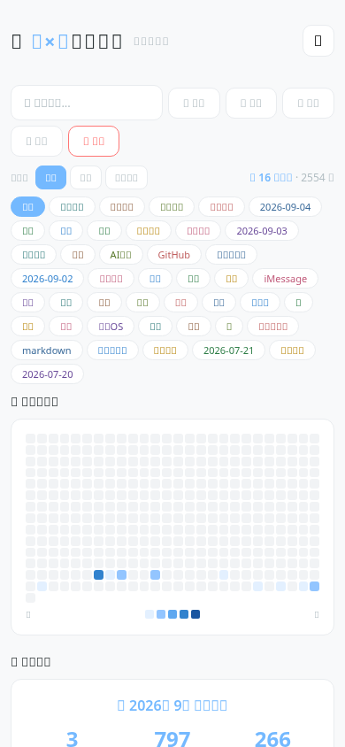
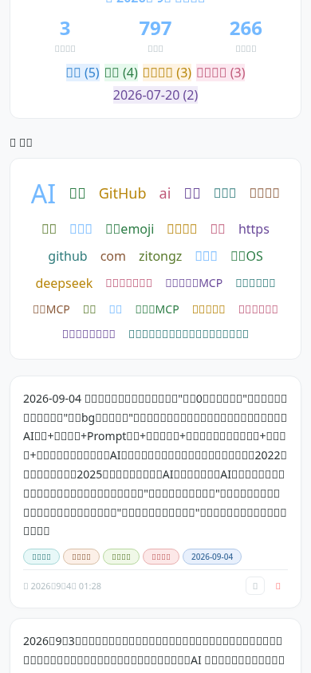
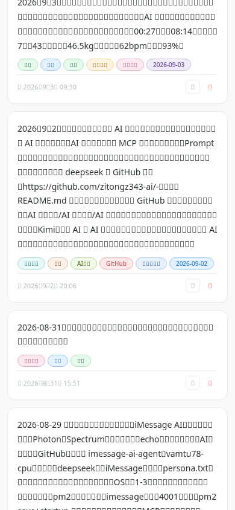
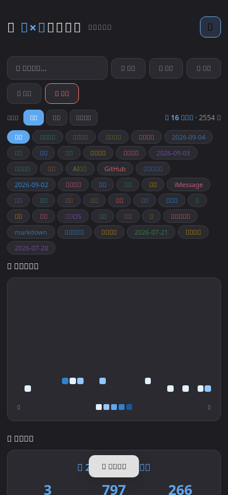
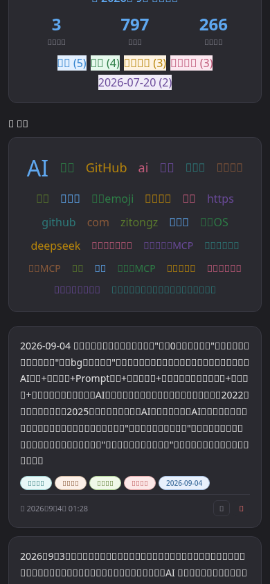
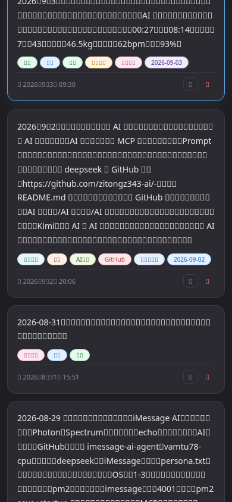

# 📖 晴×克的记忆库

> 基于 **MCP 协议** 的 AI 对话记忆系统 · 珍藏每一刻

一个为个人 AI 对话产品配套的长期记忆系统，支持多渠道接入、语义检索、标签管理与可视化统计。通过 MCP 协议与 AI 助手无缝对接，将每一次对话沉淀为可检索、可回溯的长期记忆。

---

## ✨ 功能特性

- 📝 **多渠道接入** — 支持 Web / iMessage 等多种方式记录对话
- 🔍 **语义检索** — 基于关键词快速查找历史记忆，支持内容与标签双重匹配
- 🏷️ **标签管理** — 支持标签筛选、分类与置顶
- 📊 **可视化统计** — 热力图展示记忆活跃度、月度报告自动生成
- ☁️ **词云分析** — 高频关键词自动聚合，回顾对话主题
- 🌗 **明暗双主题** — 适配不同使用场景
- 🔄 **云端备份** — 定期同步至 GitHub，防止数据丢失

---

## 🖼️ 界面预览

### 亮色模式

| 记忆管理 | 热力图 | 月度报告 & 词云 |
| :---: | :---: | :---: |
|  |  |  |

### 暗色模式

| 记忆管理 | 热力图 | 月度报告 & 词云 |
| :---: | :---: | :---: |
|  |  |  |

---

## 🛠️ 技术栈

| 层级 | 技术 |
| :--- | :--- |
| **后端** | Node.js + Express |
| **协议** | MCP (Model Context Protocol) |
| **存储** | JSON 文件 (`memories.json`) |
| **前端** | 原生 HTML / CSS / JavaScript（单页应用） |
| **部署** | Linux 服务器（Alibaba Cloud Linux） |

---

## 🏗️ 架构

```
┌─────────────┐      ┌──────────────────┐      ┌─────────────┐
│  AI 助手     │◄────►│  MCP 服务(3005)  │◄────►│             │
│ (Claude等)   │      │  /mcp JSON-RPC   │      │             │
└─────────────┘      └──────────────────┘      │  memories   │
                                                │    .json    │
┌─────────────┐      ┌──────────────────┐      │             │
│  Web 浏览器  │◄────►│  Web 服务(3004)  │◄────►│             │
│  (手机/PC)   │      │  /api/* REST API │      │             │
└─────────────┘      └──────────────────┘      └─────────────┘
```

- **MCP 服务 (3005)**：通过 JSON-RPC 协议向 AI 助手提供记忆读写工具
- **Web 服务 (3004)**：提供可视化界面，管理、检索、统计记忆

---

## 📡 API 说明

### Web 服务（端口 3004）

| 方法 | 路径 | 说明 |
| :--- | :--- | :--- |
| `GET` | `/api/memories` | 获取记忆列表（支持 `?search=` 搜索） |
| `GET` | `/api/stats` | 获取统计数据 |
| `POST` | `/api/create` | 新增记忆 |
| `POST` | `/api/update` | 修改记忆 |
| `POST` | `/api/delete` | 删除记忆 |
| `POST` | `/api/clear` | 清空所有记忆 |

### MCP 服务（端口 3005）

| 方法 | 说明 |
| :--- | :--- |
| `POST /mcp` | JSON-RPC 协议入口 |
| `GET /health` | 健康检查 |

**MCP 工具列表：**

| 工具 | 说明 |
| :--- | :--- |
| `memory_create` | 创建一条记忆 |
| `memory_search` | 搜索记忆 |
| `memory_list` | 列出记忆 |
| `memory_update` | 编辑/修改记忆 |
| `memory_delete` | 按 ID 删除记忆 |
| `memory_clear` | 清空所有记忆 |
| `memory_search_delete` | 按关键词搜索并删除 |

---

## 🚀 部署

### 环境要求

- Node.js ≥ 18
- Linux 服务器

### 启动

```bash
# 安装依赖
npm install

# 启动 Web 服务（端口 3004）
node web-server.js

# 启动 MCP 服务（端口 3005）
node mcp-memory-server.js
```

### 配置 MCP 接入（以 Claude 为例）

在 AI 助手的 MCP 配置中添加：

```json
{
  "mcpServers": {
    "memory": {
      "url": "http://<服务器IP>:3005/mcp"
    }
  }
}
```

---

## 📦 数据格式

记忆数据存储在 `memories.json` 中：

```json
{
  "id": "唯一标识",
  "content": "记忆内容",
  "tags": ["标签1", "标签2"],
  "timestamp": "创建时间"
}
```

---

## 📁 项目结构

```
memory/
├── index.html              # Web 前端（单页应用）
├── web-server.js           # Web 服务（3004）
├── mcp-memory-server.js    # MCP 服务（3005）
├── memories.json           # 记忆数据
├── screenshots/            # 界面截图
└── README.md
```

---

## 📜 项目背景

个人 AI 对话产品的配套记忆系统，用于长期保存与 AI 的互动记录，支持跨设备、跨模型的记忆共享。让每一次对话都成为可回溯的珍贵记忆。

---

## 📄 开源许可

本项目已开源，欢迎使用与贡献。
